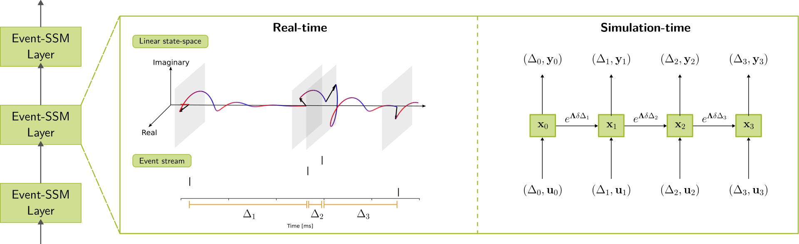

# Scalable Event-by-event Processing of Neuromorphic Sensory Signals With Deep State-Space Models

This is the official implementation of our paper [Scalable Event-by-event Processing of Neuromorphic Sensory Signals With Deep State-Space Models
](https://arxiv.org/abs/2404.18508).
The core motivation for this work was the irregular time-series modeling problem presented in the paper [Simplified State Space Layers for Sequence Modeling
](https://arxiv.org/abs/2208.04933). 
We acknowledge the awesome [S5 project](https://github.com/lindermanlab/S5) and the trainer class provided by this [UvA tutorial](https://uvadlc-notebooks.readthedocs.io/en/latest/tutorial_notebooks/guide4/Research_Projects_with_JAX.html), which highly influenced our code.

Our project treats a quite general machine learning problem:
Modeling **long sequences** that are **irregularly** sampled by a possibly large number of **asynchronous** sensors.
This problem is particularly present in the field of neuromorphic computing, where event-based sensors emit up to millions events per second from asynchronous channels.

We show how linear state-space models can be tuned to effectively model asynchronous event-based sequences.
Our contributions are
- Integration of dirac delta coded event streams
- time-invariant input normalization to effectively learn from long event-streams
- formulating neuromorphic event-streams as a language modeling problem with **asynchronous tokens**
- effectively model event-based vision **without frames and without CNNs** 

## Installation
The project is implemented in [JAX](https://github.com/google/jax) with [Flax](https://flax.readthedocs.io/en/latest/). 
By default, we install JAX with GPU support with CUDA >= 12.0.
To install JAX for CPU, replace `jax[cuda]` with `jax[cpu]` in the `requirements.txt` file.
PyTorch is only required for loading data.
Therefore, we install only the CPU version of PyTorch.
Install the requirements with
 ```bash
 pip install -r requirements.txt
 ```
Install this repository
 ```bash
 pip install -e .
 ```
We tested with JAX versions between `0.4.20` and `0.4.29`.
Different CUDA and JAX versions might result in slightly different results.

## Reproducing experiments
We use the [hydra](https://hydra.cc/docs/intro/) package to manage configurations.
If you are not familiar with hydra, we recommend to read the [documentation](https://hydra.cc/docs/intro/).

### Run benchmark tasks
The basic command to run an experiment is
```bash
python run_training.py
```
This will default to running the Spiking Heidelberg Digits (SHD) dataset.
All benchmark tasks are defined by the configurations in `configs/tasks/`, and can be run by specifying the `task` argument.
E.g. run the Spiking Speech Commands (SSC) task with
```bash
python run_training.py task=spiking-speech-commands
```
or run the DVS128 Gestures task with
```bash
python run_training.py task=dvs-gesture
```

### Trained models
We provide our best models for [download](https://datashare.tu-dresden.de/s/g2dQCi792B8DqnC).
Check out the `tutorial_inference.ipynb` notebook to see how to load and run inference with these models.
We also provide a script to evaluate the models on the test set
```bash
python run_evaluation.py task=spiking-speech-commands checkpoint=downloaded/model/SSC
```


### Specify HPC system and logging
Many researchers operate on different HPC systems and perhaps log their experiments to multiple platforms.
Therefore, the user can specify configurations for 
- different systems (directories for reading data and saving outputs)
- logging methods (e.g. whether to log locally or to [wandb](https://wandb.ai/))

By default, the `configs/system/local.yaml` and `configs/logging/local.yaml` configurations are used, respectively.
We suggest to create new configs for the HPC systems and wandb projects you are using.

For example, to run the model on SSC with your custom wandb logging config and your custom HPC specification do
```bash
python run_training.py task=spiking-speech-commands logging=wandb system=hpc
```
where `configs/logging/wandb.yaml` should look like
```yaml
log_dir: ${output_dir}
interval: 1000
wandb: False
summary_metric: "Performance/Validation accuracy"
project: wandb_project_name
entity: wandb_entity_name
```
and `configs/system/hpc.yaml` should specify data and output directories
```yaml
# @package _global_

data_dir: my/fast/storage/location/data
output_dir: my/job/output/location/${task.name}/${oc.env:SLURM_JOB_ID}/${now:%Y-%m-%d-%H-%M-%S}
```
The string `${task.name}/${oc.env:SLURM_JOB_ID}/${now:%Y-%m-%d-%H-%M-%S}` will create subdirectories named by task, slurm job ID, and date,
which we found useful in practice.
This specification of the `output_dir` is not required though.

## Tutorials
To get started with event-based state-space models, we created tutorials for training and inference.
- `tutorial_training.ipynb` shows how to train a model on a reduced version of the Spiking Heidelberg Digits with just two classes. The model converges after few minutes on CPUs.
- `tutorial_inference.ipynb` shows how to load a trained model and run inference. The models are available for download from the provided [download link](https://datashare.tu-dresden.de/s/g2dQCi792B8DqnC).
- `tutorial_online_inference.ipynb` runs event-by-event inference with batch size one (online inference) on the DVS128 Gestures dataset and measures the throughput of the model.

## Help and support
We are eager to help you with any questions or issues you might have. 
Please use the GitHub issue tracker for questions and to report issues.

## Citation
Please use the following when citing our work:
```
@misc{Schoene2024,
      title={Scalable Event-by-event Processing of Neuromorphic Sensory Signals With Deep State-Space Models}, 
      author={Mark Schöne and Neeraj Mohan Sushma and Jingyue Zhuge and Christian Mayr and Anand Subramoney and David Kappel},
      year={2024},
      eprint={2404.18508},
      archivePrefix={arXiv},
      primaryClass={cs.LG}
}
```
